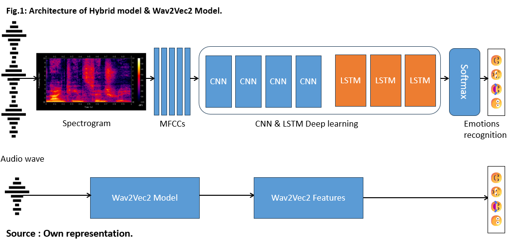
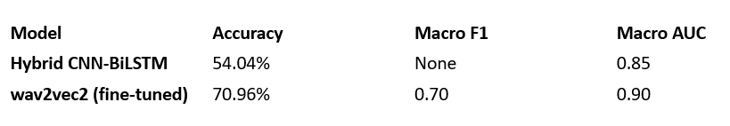

# Speech Emotion Recognition (SER) – Hybrid CNN‑BiLSTM & wav2vec2

This repository contains two deep learning pipelines for recognizing emotions from speech:

1. **Hybrid CNN‑BiLSTM** – A lightweight model that combines convolutional layers for local feature extraction and bidirectional LSTM for temporal context.
2. **wav2vec2** – A pretrained transformer model (from Hugging Face) fine‑tuned for emotion classification, achieving state‑of‑the‑art performance.

Both models are trained and evaluated on a **6‑emotion dataset** (Angry, Disgust, Fear, Happy, Neutral, Sad) with **7,442 audio clips**.

---

## Table of Contents
- [Project Structure](#project-structure)
- [Architecture](#architecture)
- [Installation](#installation)
- [Dataset](#dataset)
- [Feature Extraction (Hybrid Model)](#feature-extraction-hybrid-model)
- [Training the Hybrid Model](#training-the-hybrid-model)
- [Training wav2vec2](#training-wav2vec2)
- [Evaluation](#evaluation)
- [Results](#results)
- [Use Cases](#use-cases)
- [Limitations & Future Work](#limitations--future-work)

---

## Project Structure
SER_Project/
├── hybrid_model/
│ ├── train_hybrid.py # Training script for CNN‑BiLSTM
│ └── utils.py # Feature extraction, data loading
│
├── wav2vec2_model/
│ ├── train_wav2vec2.py # Fine‑tuning script for wav2vec2
│ └── config.yaml # Hyperparameters
│
├── results/ # Saved models, logs, Excel reports
├── README.md
└── requirements.txt

---
## Architecture

## Installation

1. **Clone the repository** (or copy the scripts).
2. **Create a virtual environment** (Python 3.8+ recommended).
3. **Install dependencies**:
4. **Create requirements.txt file and copy these below libraries**

- librosa==0.10.1
- numpy==1.24.3
- pandas==2.0.3
- tensorflow==2.15.0
- torch==2.1.0
- transformers==4.35.0
- scikit-learn==1.3.0
- tqdm==4.66.1
- openpyxl==3.1.2

```bash
pip install -r requirements.txt
```

## Dataset
Flat structure (files with emotion codes in filename):
- 1031_IEO_DIS_MD.wav, etc.

## Feature Extraction (Hybrid Model)

For the hybrid model, we extract MFCC features:

   **Number of coefficients:**  39

   **Window length:** 25 ms

   **Hop length:** 10 ms

   **Fixed audio length:** 200 samples (~2 seconds at 16kHz) – pad or truncate.

## Training the Hybrid Model

The hybrid model is a **CNN‑BiLSTM** . Key hyperparameters:
- Conv filters  ==	 39
- Kernel size   ==   3
- BiLSTM units  ==  384
- Dropout	    ==  0.3
- Batch size    ==  64
- weight_decay = 1e-4   
- Learning rate == 1e-3
- Epochs	    ==  70

## Training wav2vec2

We use the pretrained model facebook/wav2vec2-base from Hugging Face and fine‑tune it for emotion classification.

## Preparation
-   Raw audio (variable length) is used – wav2vec2 expects waveform tensors.
-   The dataset is split into train/validation (80/20) per fold (or use the same 10‑fold splits for fair comparison).

Key hyperparameters:
- Pretrained model == facebook/wav2vec2-base
- Learning rate	   ==   2e-5
- Batch size	   ==    8
- Epochs	       ==    10
- Weight decay	   ==    0.01
- Warmup steps	   ==    500
- max_grad_norm = 1.0        
- early_stopping_patience = 4 
- warmup_ratio = 0.2
- gradient_accumulation_steps = 2


The script outputs:

-   Fine‑tuned model weights.

-   Validation accuracy and loss curves.

-    Classification report

## Evaluation

Both models are evaluated on the same test folds (or a held‑out test set). Metrics:

   **Accuracy**

   **Macro F1‑score**

   **Macro AUC (one‑vs‑rest)**

## Results

##### Observations:

 -   wav2vec2 outperforms the hybrid model by ~16% in accuracy, especially in distinguishing positive vs. negative valence (“valence gap”).

  -  The hybrid model is much smaller (≈5M parameters) and can run on edge devices.

  -  Common confusions: fear ↔ surprise, disgust ↔ anger.

## Use Cases

   **Mental health monitoring:** Detect signs of depression or anxiety from speech diaries (with user consent).

   **Automotive safety:** Identify driver stress/anger and adjust cabin environment.

   **Empathetic virtual assistants:** Escalate frustrated customers to human agents.

   **Educational technology:** Measure student engagement and confusion during online lessons.

## Limitations & Future Work
#### Limitations

   **Emotion subjectivity**: Labels may be ambiguous; ground truth is not absolute.

   **Cross‑corpus degradation:** Performance drops on unseen speakers or languages.

   **Computational cost:** wav2vec2 requires a GPU for fine‑tuning and inference.

   **Privacy concerns:** Emotion recognition can be misused for surveillance.

#### Future improvements

   **Multimodal fusion** (audio + text + facial expressions).

   **Cross‑lingual adaptation** using self‑supervised models.

   **Fairness evaluation** across age, gender, and accent groups.

   **On‑device deployment** with quantisation and pruning.#

   